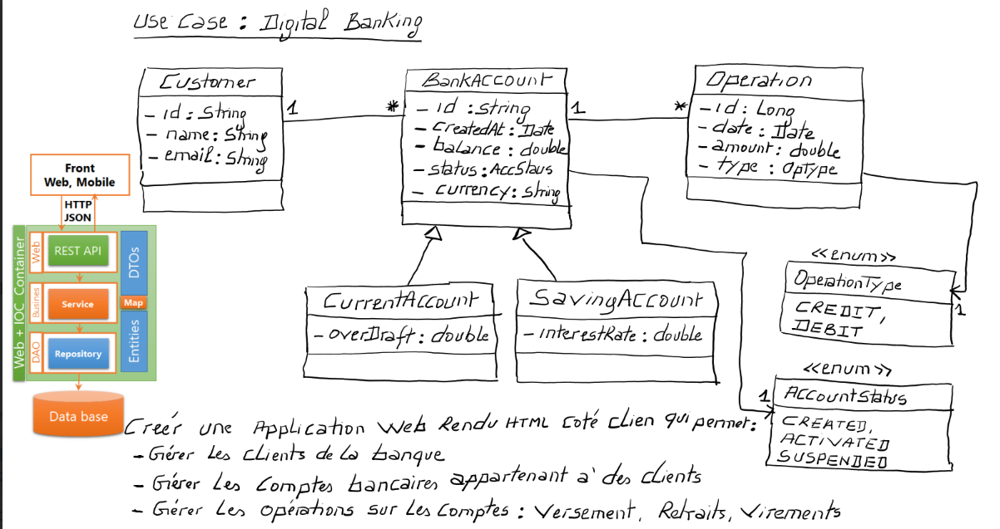

# E-Banking Application

A comprehensive full-stack E-Banking system designed to manage customers, bank accounts, and banking operations (debit, credit, and transfer). The project is divided into a robust RESTful backend built with Spring Boot and a dynamic, responsive frontend built with Angular.

## Technical Architecture



The application follows a standard multi-tier architecture using Spring Boot to provide a secure REST API (stateless with JWT) and Angular for a modular Single Page Application (SPA).

## Features

- **Authentication & Authorization**: Secure login with JWT. Role-based access control (Admin, User) using route guards.
- **Customer Management**: Add, view, search, and manage bank customers.
- **Account Management**: Support for Current Accounts and Saving Accounts.
- **Banking Operations**: Perform transactions including Debits, Credits, and Transfers between accounts.
- **Transaction History**: View the history of operations for any given account.

## Project Structure

The workspace contains the following main modules:

- `ebanking-backend/`: The Spring Boot API providing business logic, security, and persistence.
- `ebanking-frontend/`: The Angular application for the user interface.
- `media/`: Project assets (architecture diagrams, demo videos).

## Technologies Used

### Backend

- Java / Spring Boot
- Spring Security (JWT Auth)
- Spring Data JPA
- Maven

### Frontend

- Angular
- TypeScript
- HTML/CSS

## Getting Started

### Prerequisites

- JDK 17 or higher
- Node.js & npm
- Angular CLI

### Running the Backend

1. Navigate to the backend directory:
   ```bash
   cd ebanking-backend
   ```
2. Start the Spring Boot application:
   ```bash
   ./mvnw spring-boot:run
   ```
   _(Make sure to configure your database settings in `src/main/resources/application.properties` if needed)._

### Running the Frontend

1. Navigate to the frontend directory:
   ```bash
   cd ebanking-frontend
   ```
2. Install dependencies:
   ```bash
   npm install
   ```
3. Start the development server:
   ```bash
   ng serve
   ```
4. Open your browser and navigate to `http://localhost:4200/`.
<!-- 
## Demo

Check out the application demo below:

 -->
